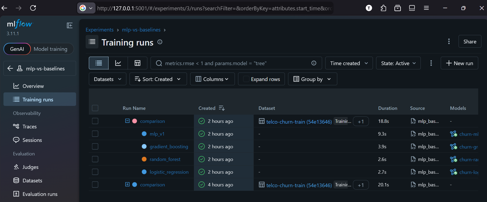
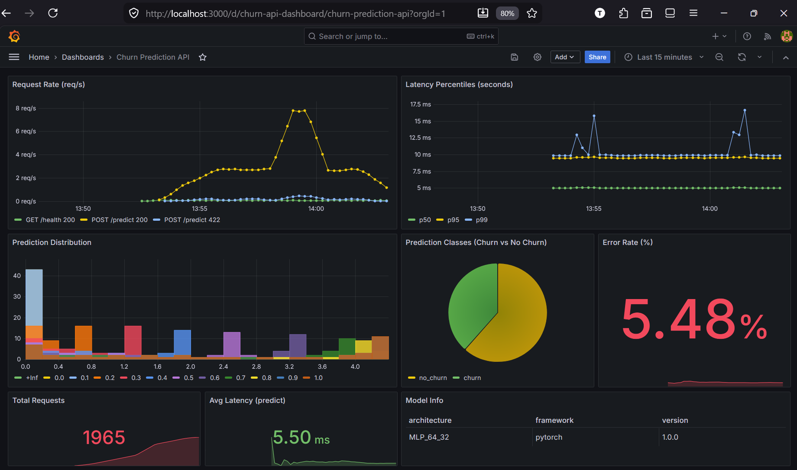

# Churn Prediction — FIAP ML Engineering Tech Challenge

End-to-end machine learning project that predicts customer churn for a telecommunications company using a PyTorch MLP neural network.

## Documents

1. [ML Canvas](docs/ml_canvas.md)
2. [Exploratory Data Analysis (EDA)](notebooks/01_eda.ipynb)
3. [Model Card](docs/model_card.md)
4. [Deployment Architecture](docs/deployment_architecture.md)
5. [Monitoring Plan](docs/monitoring_plan.md)

## Quick Start

1. Clone and set up environment

```bash
git clone https://github.com/thiagolcmelo/churn-prediction.git
cd churn-prediction
python3 -m venv .venv
source .venv/bin/activate
```

2. Install dependencies

```bash
pip install -e ".[dev]"
```

3. Run tests

```bash
make test
```

4. Start the API

```bash
make run
```

API available at [`http://localhost:8000/docs`](http://localhost:8000/docs).

5. Test prediction

```bash
curl -X POST http://localhost:8000/predict \
  -H "Content-Type: application/json" \
  -d '{
    "tenure": 12,
    "MonthlyCharges": 70.5,
    "TotalCharges": 846.0,
    "Contract": "Month-to-month",
    "InternetService": "Fiber optic",
    "TechSupport": "No",
    "OnlineSecurity": "No",
    "gender": "Male",
    "SeniorCitizen": 0,
    "Partner": "Yes",
    "Dependents": "No",
    "PhoneService": "Yes",
    "MultipleLines": "No",
    "OnlineBackup": "Yes",
    "DeviceProtection": "No",
    "StreamingTV": "Yes",
    "StreamingMovies": "No",
    "PaperlessBilling": "Yes",
    "PaymentMethod": "Electronic check"
  }'
```

Expected output:

```json
{"churn_probability":0.8155,"churn_prediction":true,"threshold":0.5}
```

## Project Structure

```
churn-prediction/
├── src/                    # Source code
│   ├── data/               # Data loading and preprocessing
│   ├── models/             # Model definitions and training
│   ├── api/                # FastAPI application
│   └── utils/              # Config, logging utilities
├── data/raw/               # Raw dataset (not committed)
├── models/                 # Trained model artifacts
├── notebooks/              # EDA and modeling notebooks
├── tests/                  # Automated tests
├── scripts/                # Utility scripts
├── monitoring/             # Prometheus + Grafana config
├── docs/                   # Documentation
├── docker-compose.yml      # Multi-container deployment
├── Dockerfile              # API container image
├── pyproject.toml          # Project config and dependencies
└── Makefile                # Common commands
```

## MLflow Experiment Tracking

View all experiments:

```
mlflow ui --port 5001
```



Open [`http://localhost:5001`](http://localhost:5001).

## Docker Deployment (with monitoring)

Start API + Prometheus + Grafana:

```
docker compose up --build
```

Services:
- *API*: [`http://localhost:8000/docs`](http://localhost:8000/docs) (interactive API docs)
- *MLflow*: [`http://localhost:5001`](http://localhost:5001) (experiment tracking UI)
- *Prometheus*: [`http://localhost:9090`](http://localhost:9090) (metrics query interface)
- *Grafana*: [`http://localhost:3000`](http://localhost:3000) (dashboards — login: admin/admin)

Simulate traffic for monitoring demo ([sample](scripts/sample_simulation.txt)):

```
python scripts/simulate_traffic.py
```

Expected preview in Grafana:



Stop:

```
docker compose down
```